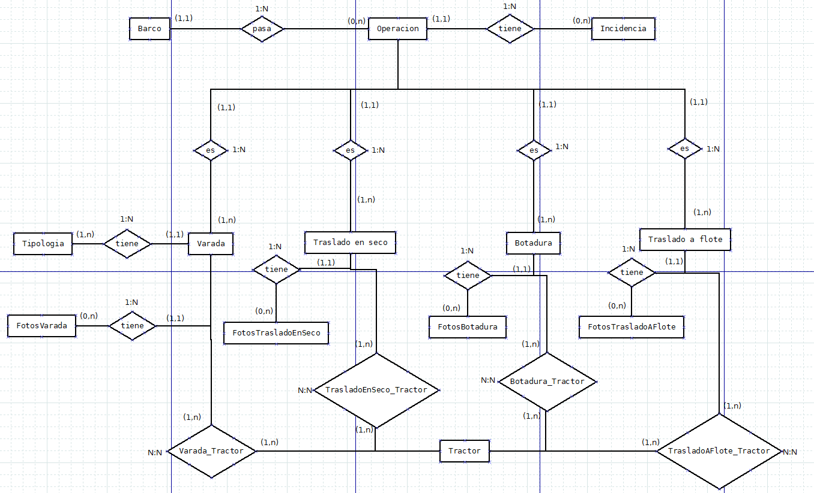
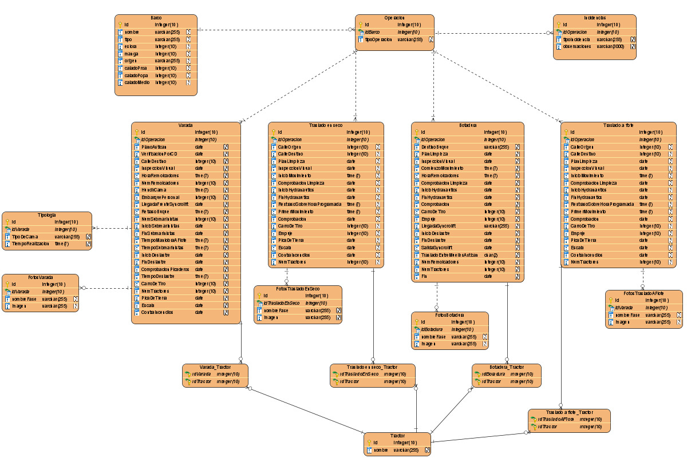

# Proyecto Astican : Documentación

## Índice
* [1. Introducción](#idIntroduccion)

* [2. Diagramas](#idDiagramas)
  * [2.1. Diagrama de entidad relacion](#idER)
  * [2.2. Modelo relacional](#idMR)

* [3. Requisitos de Usuario](#idReqUsu)

* [4. Casos de Uso](#idCasosDeUso)

* [5. Descripción del funcionamiento del sistema y especificaciones técnicas de la aplicación del servidor, móvil y web](#idDescripcion)

* [6. Interfaces](#idInterfaces)
  * [6.1. Diseño Inicial](#idDiseño)
  * [6.2. Usabilidad](#idUsabilidad)

* [7. Manuales](#idManuales)

* [8. Pila Tecnológica](#idPilaTecnologica)
  * [8.1. Microsoft Power Apps](#idPowerApps)
  * [8.2. Microsoft Excel](#idExcel)

* [9. Comparación de tecnologías](#idComparacionTecnologias)

* [10. Repositorios](#idRepositorios)

* [11. Planificación](#idPlanificacion)

* [12. Conclusiones](#idConclusiones)

* [13. Enlaces  y referencias](#idEnlaceReferencias)

## 1. Introducción

La aplicación a desarrollar es para ASTICAN una empresa dedicada principalmente a la reparación de barcos tanto fuera como dentro del agua, es decir, es un astillero.
La idea de la aplicación surge de la necesidad de liberar de trabajo al encargado de llevar todo el procedimiento de sacar el barco del mar y llevarlo a la calle en la que se trabajará con él y también del proceso contrario, devolverlo al mar tras su reparación.
Esta aplicación deberá facilitar la labor del encargado recogiendo datos de forma automática y de forma manual que dicho usuario escribirá. Estos datos serán guardados en las hojas excel que tiene la empresa para poder hacer un seguimiento de la duración media de cada operación así como la duración de todo el proceso entre otros.
La aplicación también debe permitir que otros usuarios que están relacionados con el proceso puedan ver en que estado se encuentra el mismo, evitando así llamadas telefónicas al encargado de todo el proceso. Con todo lo anterior dicho, se espera que la aplicación aumente la eficiencia del proceso anulando llamadas innecesarias y la toma de datos en papel para después ser pasada a ordenador.

## 2. Diagramas

### 2.1. Diagrama de entidad relación:

Este es el diagrama de entidad relación de la aplicación. al ser tan grande los atributos no se muestran, estos serán mostrados en el modelo relacional en el siguiente apartado. Como se puede observar, existen varias tablas, estas tablas son "Barco", "Operación", "Incidencia", "Tipologia", "Varada", "Traslado en seco", "Botadura", "Traslado a flote", "FotosVarada", "FotosTrasladoEnSeco", "FotosBotadura", "FotosTrasladoAFlote" y por último "Tractor".
Cada una de las tablas tiene su propio identificador como clave primaria por lo que no pueden ser ni null ni se pueden repetir dentro de la misma tabla. Algunas tablas tienen una clave foránea debido a la relación que tienen con otras tablas, este es el caso de la tabla "Operación" que tiene una clave foránea proviniente de la tabla "Barcos", siendo la clave de "Operación",a su vez, clave foránea en las tablas "Varada", "Traslado en seco", "Botadura", "Traslado a flote" e "incidencias". Las tablas "Tipologia" y "FotosVarada" tienen como clave foránea la clave de la tabla "Varada" mientras que las otras tres tablas de fotos tienen como clave foránea las claves primarias de sus respectivas operaciones, es decir, "FotosTrasladoEnSeco" tiene la de "Traslado en seco", "FotosBotadura" tiene la de "Botadura" y "Traslado a flote" tiene la de "Traslado a flote".

En cuanto a las relaciones son todas de uno a muchos excepto cuatro de ellas que pasarán a ser tablas más adelante debido a la relación de muchos a muchos que forman entre la tabla "Tractor" y las tablas "Varada", "Traslado en seco", "Botadura" y "Traslado a flote". Las cuatro relaciones mencionadas son "Varada_Tractor", "TrasladoEnSeco_Tractor", "Botadura_Tractor" y "TrasladoAFlote_Tractor" cada una de ellas tendrá como clave principal, el conjunto de las claves de "Tractor" y una de las claves de las tablas mencionadas anteriormente según les correpondan.

### 2.2. Modelo relacional:

A lo dicho en el diagrama entidad relación se une el modelo relacional. Se puede ver todo el modelo de datos ya diseñado con todos sus atributos, la mayoría de ellos son de tipo "date". En un principio la mayoría de estos datos no podrán ser null.

Se puede ver también como las relaciones muchos a muchos se han transformado en tablas como se mencionó antes, estas son "Varada_Tractor", "TrasladoEnSeco_Tractor", "Botadura_Tractor" y "TrasladoAFlote_Tractor".

## 3. Requisitos de usuario

Esta aplicación será utilizada por dos tipos de usuario, el gestor y los usuarios autorizados de Astican.

El gestor podrá hacer uso de todas las opciones de la aplicación, esto implica la escritura y edición de datos además de poder consultar el estado de la operación actual y ver los datos de operaciones anteriores buscando por tipo de operación, barcos etc. Como se mencionó previamente, la acción principal que puede cumplir el gestor es la de escritura de datos ya que en cada operación debe recoger una serie de datos que luego se guardarán en una base de datos, una vez termine de escribir los datos tiene la opción de editarlos en caso de que se equivoque, le falte o le sobre algún dato. Al terminar un paso u operación se actualizará el visualizador donde el propio gestor podrá ver que tal va la operación y en caso de querer cambiar algo podrá hacerlo, adicionalmente podrá buscar operaciones anteriores. En resumen, el gesetor puede escribir, modificar y ver los detalles en esta aplicación.

Los usuarios autorizados de Astican solo podrán ver el estado de la operación actual y sus detalles. Los detalles son todos los datos de las operaciones que el gestor ha ido rellenando y guardando en la base de datos.

## 4. Casos de Uso

De los requisitos de usuarios mencionados en el anterior apartado surge este diagrama de casos de uso.

## 5. Descripción del funcionamiento del sistema y especificaciones técnicas de la aplicación

## 6. Interfaces

### 6.1. Diseño Inicial:

Al iniciar la aplicación aparecerá una página de Login debido a que hay dos tipos de usuario que usarán la aplicación.

El primer tipo de usuario es el gestor, es la única persona que hará uso de todas las funcionalidades de la aplicación, tras iniciar sesión entrará a su menú. En el menú encontrará botones con los procedimientos que puede realizar y al final un botón que le muestra una previsualización de los procedimientos.

El botón "varada", "traslado en seco", "botadura" y "traslado en mojado" llevan a las ventanas donde se muestran los pasos de cada procedimiento mientras que el botón "ver procedimientos" permite como ya ha sido mencionado, previsualizar los procedimientos.

A continuación se muestran unos ejemplos de como se verían las ventanas para rellenar los datos de cada procedimiento, la ventana del primer paso se abriría al pulsar en el botón "varada", "traslado en seco", "botadura" y "traslado en mojado" de la interfaz mostrada anteriormente.

Al final de cada paso se muestra un botón para ir al siguiente excepto en el último que desplegaría la ventana de resumen que se muestra a continuación, esta ventana permite ver los datos recogidos en la operación actual y editarlos en caso de que fuera necesario, para editarlos solo habría que darle al botón circular con un lápiz y se abriría la ventana de edición.

En la ventana de resumen también hay un botón que al clickar sobre él verificará si todos los datos son correctos y finalizará la operación.

Como se puede ver en todas las interfaces que no son el login, en la parte superior izquierda se encuentra una flecha blanca, esta sirve para volver a la interfaz anterior.

Volviendo al menú del gestor, al pulsar el botón "ver procedimientos" se abrirá la siguiente ventana. Esta permite ver el estado en el que se encuentra cada proceso de forma individual, se pueden ampliar los detalles pulsando el botón "ver detalles" de cada procedimiento, lo que abrirá la ventana detalles que a su vez permite la edición, al clickar en el lápiz, de dicho procedimiento abriendo de nuevo la ventana de edición.

En la parte inferior derecha se encunetra un botón con una lupa, este botón permitirá al gestor buscar los procedimientos por fecha, tipo de barco etc.

Al otro tipo de usuario corresponden los trabajadores de Astican que tienen que ver con el proceso, es por esto que al iniciar sesión solo podrán acceder al visualizador de usuario. Este funciona como el del gestor pero no tienen la posibilidad de buscar operaciones anteriores dado que en principio no lo necesitan hacer. La otra diferencia es que al entrar en detalles no verán la opción de editar.

### 6.2. Usabilidad:

La aplicación cumple con varias de las características más importantes de usabilidad. Es una aplicación útil ya que abarca todos los aspectos requeridos por la empresa, permite a los usuarios de Astican visualizar el estado de la operación actual así como permite al gestor recoger y editar los datos además de visualizar el proceso actual y anteriores. Al tener la capacidad de editar los datos recogidos se puede afirmar que la aplicación prevee errores, en caso de que algún dato estuviese mal, la aplicación antes de guardar los datos en la base de datos hace una revisión a ver si todos son correctos dando la oportunidad de editarlos en caso de no serlo.

La interfaz goza de simpleza y elegancia con una paleta de colores bastante pequeña, los colores utilizados son el azul oscuro, gris, blanco y algo de negro. Se ha intentado hacer una interaz lo más fácil de aprender posible utilizando iconos y textos bastante explicativos como son el lápiz para editar o la flecha para volver atrás y los botones con un texto que te dice la función que realizan.

La aplicación ofrecerá al gestor de la operación un gran beneficio en términos de tiempo y esfuerzo dado que no tendrá que pasar los datos de papel a ordenador una vez acabe la operación y no recibirá llamadas durante la misma. El gestor puede acceder a todo el contenido ya que es el único encargado de la toma de datos y del control de la operación, es por eso que tiene la capacidad dentro de la aplicación de iniciar acciones y controlar tareas.

## 7. Manuales

## 8. Pila Tecnológica

### 8.1 Microsoft Power Apps:
Es un software que requiere de licencia para explotar todo su potencial, aún así, se puede usar de forma gratuita ofreciendo una gran cantidad de sus recursos para el desarrollo sencillo de aplicaciones.
En Power Apps se puede desarrollar una aplicación desde 0 o a partir de un modelo de datos teniendo compatibilidad con infinidad de motores de bases de datos. Este software tiene un gran potencial, es capaz de crear una aplicación con su CRUD completo a partir de una tabla de una base de datos, una vez tengas esa aplicación puedes modificar la tabla y añadir más campos a tu aplicación. Ofrece un sin fin de funciones que te permiten trabajar con los datos de una manera simple e intuitiva.

Todo en Power Apps es de manera visual, vas arrastrando los objetos que necesitas sobre un lienzo que será tu pantalla, ofrece la posibilidad de modificar el diseño de dichos objetos y de cambiarle algunas de sus características para que funcionen tal y como el usuario desea. Ofrece una gran cantidad de funciones predefinidas por las que puedes programar las funciones de los objetos. Además, da la posibilidad de crear variables a las que le puedes asignar desde un simple integer a una tabla completa de tu origen de datos.

### 8.2 Microsoft Excel:
Microsoft Excel es una hoja de cálculo mundialmente conocida que también permite el almacenaje de datos en su sistema de celdas. Gracias a la creación de tablas que proporciona Excel, se pueden guardar los datos generados en la aplicación para más tarde visualizarlos o editarlos.

## 9. Comparación de tecnologías

## 10. Repositorios

## 11. Planificación

## 12. Conclusiones

## 13. Enlaces y referencias
