# Proyecto Astican : Documentación

## Índice
* [1. Introducción](#idIntroduccion)

* [2. Diagramas](#idDiagramas)

* [3. Requisitos de Usuario](#idReqUsu)

* [4. Casos de Uso](#idCasosDeUso)

* [5. Descripción del funcionamiento del sistema y especificaciones técnicas de la aplicación del servidor, móvil y web](#idDescripcion)

* [6. Interfaces](#idInterfaces)
  * [6.1. Diseño Inicial](#idDiseño)
  * [6.2. Usabilidad](#idUsabilidad)

* [7. Manuales](#idManuales)

* [8. Pila Tecnológica](#idPilaTecnologica)
  * [8.1. Microsoft Power Apps](#idPowerApps)
  * [8.2. Microsoft Excel](#idExcel)

* [9. Comparación de tecnologías](#idComparacionTecnologias)

* [10. Repositorios](#idRepositorios)

* [11. Planificación](#idPlanificacion)

* [12. Conclusiones](#idConclusiones)

* [13. Enlaces  y referencias](#idEnlaceReferencias)

## 1. Introducción

La aplicación a desarrollar es para ASTICAN una empresa dedicada principalmente a la reparación de barcos tanto fuera como dentro del agua, es decir, es un astillero.
La idea de la aplicación surge de la necesidad de liberar de trabajo al encargado de llevar todo el procedimiento de sacar el barco del mar y llevarlo a la calle en la que se trabajará con él y también del proceso contrario, devolverlo al mar tras su reparación.
Esta aplicación deberá facilitar la labor del encargado recogiendo datos de forma automática y de forma manual que dicho usuario escribirá. Estos datos serán guardados en las hojas excel que tiene la empresa para poder hacer un seguimiento de la duración media de cada operación así como la duración de todo el proceso entre otros.
La aplicación también debe permitir que otros usuarios que están relacionados con el proceso puedan ver en que estado se encuentra el mismo, evitando así llamadas telefónicas al encargado de todo el proceso. Con todo lo anterior dicho, se espera que la aplicación aumente la eficiencia del proceso anulando llamadas innecesarias y la toma de datos en papel para después ser pasada a ordenador.

## 2. Diagramas

## 3. Requisitos de usuario

Los requisitos de usuario para hacer uso de esta aplicación son tener un sistema operativo Windows 10, tener licencia de Microsoft Excel u Office 365 y la propia aplicación.

## 4. Casos de Uso

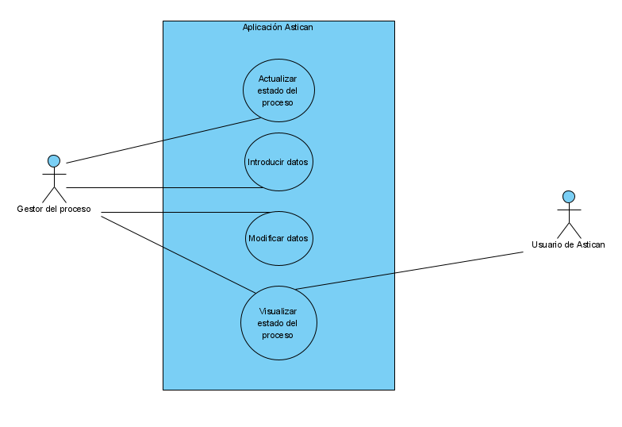

## 5. Descripción del funcionamiento del sistema y especificaciones técnicas de la aplicación

## 6. Interfaces

### 6.1. Diseño Inicial:

Al iniciar la aplicación aparecerá una página de Login debido a que hay dos tipos de usuario que usarán la aplicación.

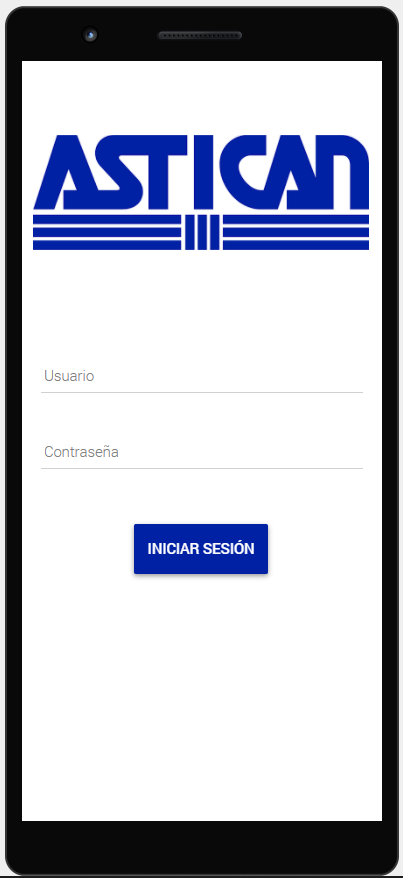

El primer tipo de usuario es el gestor, es la única persona que hará uso de todas las funcionalidades de la aplicación, tras iniciar sesión entrará a su menú. En el menú encontrará botones con los procedimientos que puede realizar y al final un botón que le muestra una previsualización de los procedimientos.

El botón "varada", "traslado en seco", "botadura" y "traslado en mojado" llevan a las ventanas donde se muestran los pasos de cada procedimiento mientras que el botón "ver procedimientos" permite como ya ha sido mencionado, previsualizar los procedimientos.

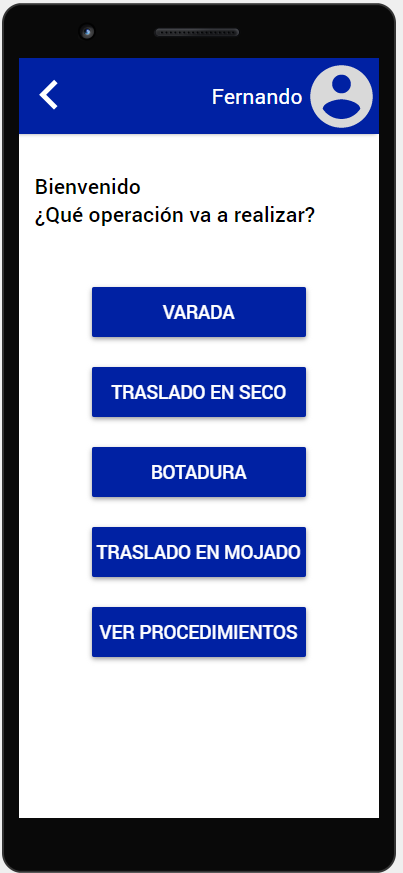

A continuación se muestran unos ejemplos de como se verían las ventanas para rellenar los datos de cada procedimiento, la ventana del primer paso se abriría al pulsar en el botón "varada", "traslado en seco", "botadura" y "traslado en mojado" de la interfaz mostrada anteriormente.

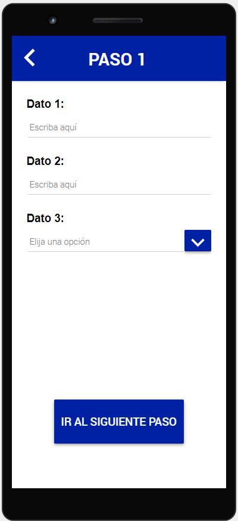
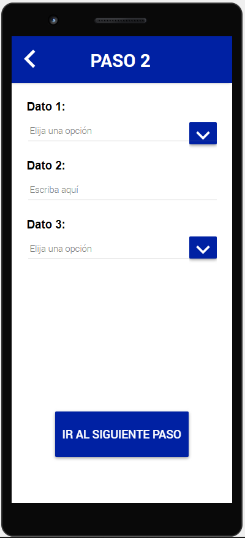
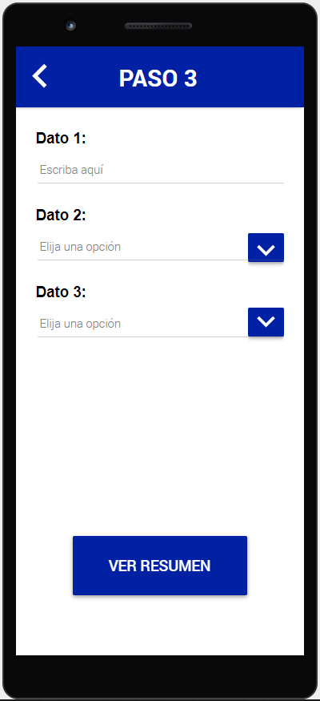

Al final de cada paso se muestra un botón para ir al siguiente excepto en el último que desplegaría la ventana de resumen que se muestra a continuación, esta ventana permite ver los datos recogidos en la operación actual y editarlos en caso de que fuera necesario, para editarlos solo habría que darle al botón circular con un lápiz y se abriría la ventana de edición.

En la ventana de resumen también hay un botón que al clickar sobre él verificará si todos los datos son correctos y finalizará la operación.

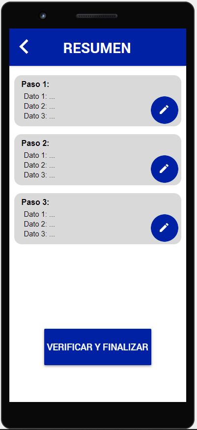
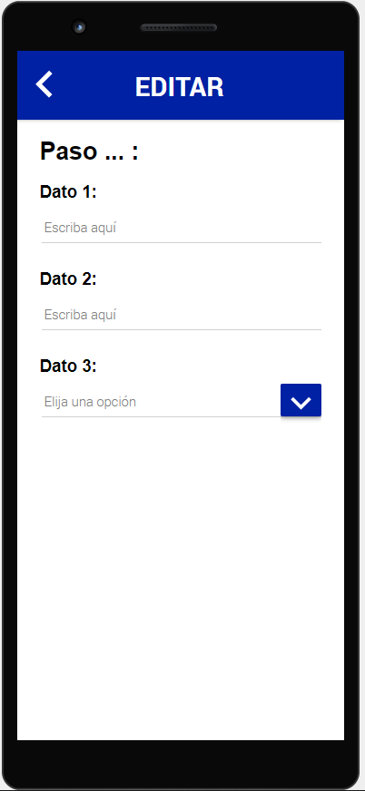

Como se puede ver en todas las interfaces que no son el login, en la parte superior izquierda se encuentra una flecha blanca, esta sirve para volver a la interfaz anterior.

Volviendo al menú del gestor, al pulsar el botón "ver procedimientos" se abrirá la siguiente ventana. Esta permite ver el estado en el que se encuentra cada proceso de forma individual, se pueden ampliar los detalles pulsando el botón "ver detalles" de cada procedimiento, lo que abrirá la ventana detalles que a su vez permite la edición, al clickar en el lápiz, de dicho procedimiento abriendo de nuevo la ventana de edición.

En la parte inferior derecha se encunetra un botón con una lupa, este botón permitirá al gestor buscar los procedimientos por fecha, tipo de barco etc.

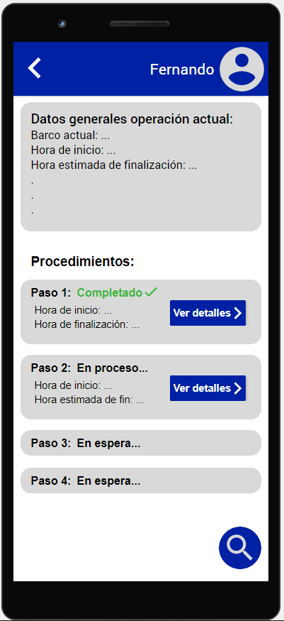
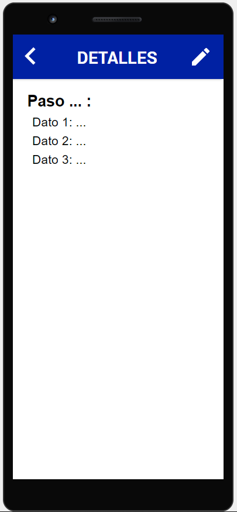

Al otro tipo de usuario corresponden los trabajadores de Astican que tienen que ver con el proceso, es por esto que al iniciar sesión solo podrán acceder al visualizador de usuario. Este funciona como el del gestor pero no tienen la posibilidad de buscar operaciones anteriores dado que en principio no lo necesitan hacer. La otra diferencia es que al entrar en detalles no verán la opción de editar.

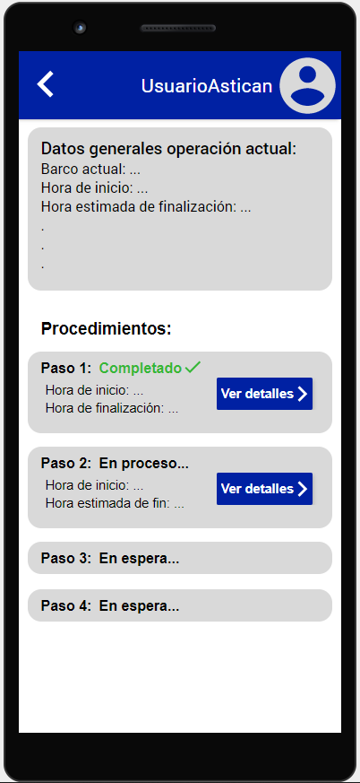
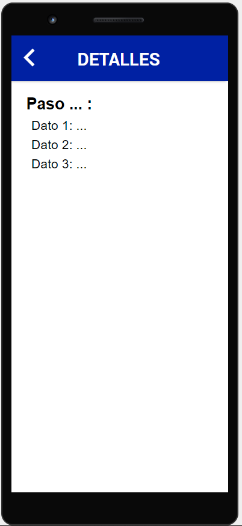

### 6.2. Usabilidad:

## 7. Manuales

## 8. Pila Tecnológica

### 8.1 Microsoft Power Apps:
Es un software que requiere de licencia que permite explotar todo su potencial, aún así, se puede usar de forma gratuita ofreciendo una gran cantidad de sus recursos para el desarrollo sencillo de aplicaciones.
En Power Apps se puede desarrollar una aplicación desde 0 o a partir de un modelo de datos teniendo compatibilidad con infinidad de motores de bases de datos. Este software tiene un gran potencial, es capaz de crear una aplicación con su CRUD completo a partir de una tabla de una base de datos, una vez tengas esa aplicación puedes modificar la tabla y añadir más campos a tu aplicación. Ofrece un sin fin de funciones que te permiten trabajar con los datos de una manera simple e intuitiva.
### 8.2 Microsoft Excel:

## 9. Comparación de tecnologías

## 10. Repositorios

## 11. Planificación

## 12. Conclusiones

## 13. Enlaces y referencias
