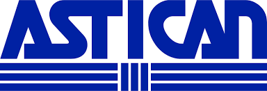

# Proyecto Astican : Documentación

## Índice
[1. Introducción](idIntroduccion)

[2. Diagramas](idDiagramas)

[3. Requisitos de Usuario](idReqUsu)

[4. Casos de Usos](idCasosDeUso)

[5. Descripción del funcionamiento del sistema y especificaciones técnicas de la aplicación del servidor, móvil y web](idDescripcion)

[6. Interfaces](idInterfaces)

[7. Manuales](idManuales)

[8. Pila Tecnológica](idPilaTecnologica)

[9. Comparación de tecnologías](idComparacionTecnologias)

[10. Repositorios](idRepositorios)

[11. Planificación](idPlanificación)

[12. Conclusiones](idConclusiones)

[13. Enlaces  y referencias](idEnlaceReferencias)

## 1. Introducción

La aplicación a desarrollar es para ASTICAN una empresa dedicada principalmente a la reparación de barcos tanto fuera como dentro del agua, es decir, es un astillero.
La idea de la aplicación surge de la necesidad de liberar de trabajo al encargado de llevar todo el procedimiento de sacar el barco del mar y llevarlo a la calle en la que se trabajará con él y también del proceso contrario, devolverlo al mar tras su reparación.
Esta aplicación deberá facilitar la labor del encargado recogiendo datos de forma automática y de forma manual que dicho usuario escribirá. Estos datos serán guardados en las hojas excel que tiene la empresa para poder hacer un seguimiento de la duración media de cada operación así como la duración de todo el proceso entre otros.
La aplicación también debe permitir que otros usuarios que están relacionados con el proceso puedan ver en que estado se encuentra el mismo, evitando así llamadas telefónicas al encargado de todo el proceso. Con todo lo anterior dicho, se espera que la aplicación aumente la eficiencia del proceso anulando llamadas innecesarias y la toma de datos en papel para después ser pasada a ordenador.
