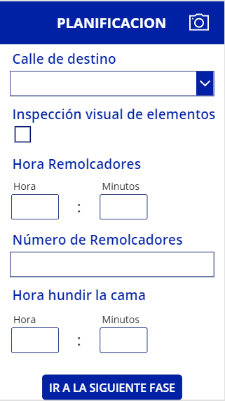
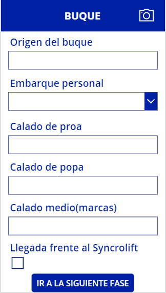
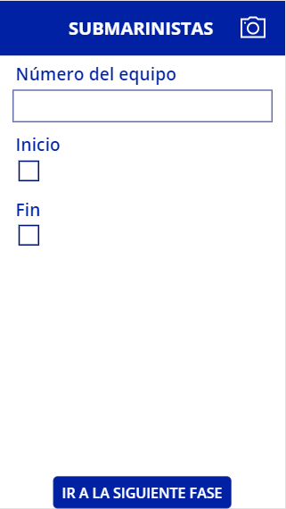
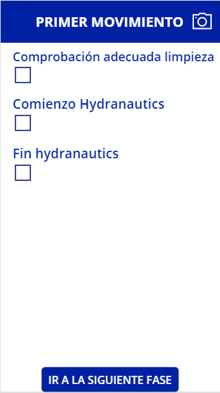
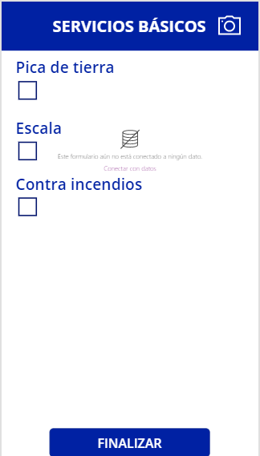
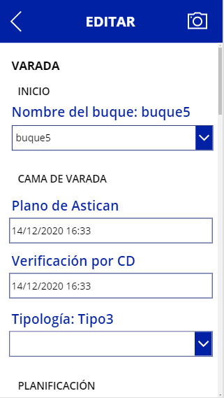

# Proyecto Astican : Documentación


## Índice
* [1. Introducción](#idIntroduccion)

* [2. Diagramas](#idDiagramas)
  * [2.1. Diagrama de entidad relacion](#idER)
  * [2.2. Modelo relacional](#idMR)

* [3. Requisitos de Usuario](#idReqUsu)

* [4. Casos de Uso](#idCasosDeUso)

* [5. Descripción del funcionamiento del sistema y especificaciones técnicas de la aplicación del servidor, móvil y web](#idDescripcion)

* [6. Interfaces](#idInterfaces)
  * [6.1. Diseño Inicial](#idDiseño)
  * [6.2. Usabilidad](#idUsabilidad)

* [7. Manuales](#idManuales)

* [8. Pila Tecnológica](#idPilaTecnologica)
  * [8.1. Microsoft Power Apps](#idPowerApps)
  * [8.2. Microsoft Excel](#idExcel)

* [9. Comparación de tecnologías](#idComparacionTecnologias)

* [10. Repositorios](#idRepositorios)

* [11. Planificación](#idPlanificacion)

* [12. Conclusiones](#idConclusiones)

* [13. Enlaces  y referencias](#idEnlaceReferencias)

## 1. Introducción<a name="idIntroduccion"></a>

La aplicación a desarrollar es para ASTICAN una empresa dedicada principalmente a la reparación de barcos tanto fuera como dentro del agua, es decir, es un astillero.
La idea de la aplicación surge de la necesidad de liberar de trabajo al encargado de llevar todo el procedimiento de sacar el barco del mar y llevarlo a la calle en la que se trabajará con él y también del proceso contrario, devolverlo al mar tras su reparación.
Esta aplicación deberá facilitar la labor del encargado recogiendo datos de forma automática y de forma manual que dicho usuario escribirá. Estos datos serán guardados en las hojas excel que tiene la empresa para poder hacer un seguimiento de la duración media de cada operación así como la duración de todo el proceso entre otros.
La aplicación también debe permitir que otros usuarios que están relacionados con el proceso puedan ver en que estado se encuentra el mismo, evitando así llamadas telefónicas al encargado de todo el proceso. Con todo lo anterior dicho, se espera que la aplicación aumente la eficiencia del proceso anulando llamadas innecesarias y la toma de datos en papel para después ser pasada a ordenador.

## 2. Diagramas<a name="idDiagramas"></a>

### 2.1. Diagrama de entidad relación:<a name="idER"></a>


Este es el diagrama de entidad relación de la aplicación. al ser tan grande los atributos no se muestran, estos serán mostrados en el modelo relacional en el siguiente apartado. Como se puede observar, existen varias tablas, estas tablas son "Barco", "Operación", "Incidencia", "Tipologia", "Varada", "Traslado en seco", "Botadura", "Traslado a flote", "FotosVarada", "FotosTrasladoEnSeco", "FotosBotadura", "FotosTrasladoAFlote" y por último "Tractor".
Cada una de las tablas tiene su propio identificador como clave primaria por lo que no pueden ser ni null ni se pueden repetir dentro de la misma tabla. Algunas tablas tienen una clave foránea debido a la relación que tienen con otras tablas, este es el caso de la tabla "Operación" que tiene una clave foránea proviniente de la tabla "Barcos", siendo la clave de "Operación",a su vez, clave foránea en las tablas "Varada", "Traslado en seco", "Botadura", "Traslado a flote" e "incidencias". Las tablas "Tipologia" y "FotosVarada" tienen como clave foránea la clave de la tabla "Varada" mientras que las otras tres tablas de fotos tienen como clave foránea las claves primarias de sus respectivas operaciones, es decir, "FotosTrasladoEnSeco" tiene la de "Traslado en seco", "FotosBotadura" tiene la de "Botadura" y "Traslado a flote" tiene la de "Traslado a flote".

En cuanto a las relaciones son todas de uno a muchos excepto cuatro de ellas que pasarán a ser tablas más adelante debido a la relación de muchos a muchos que forman entre la tabla "Tractor" y las tablas "Varada", "Traslado en seco", "Botadura" y "Traslado a flote". Las cuatro relaciones mencionadas son "Varada_Tractor", "TrasladoEnSeco_Tractor", "Botadura_Tractor" y "TrasladoAFlote_Tractor" cada una de ellas tendrá como clave principal, el conjunto de las claves de "Tractor" y una de las claves de las tablas mencionadas anteriormente según les correpondan.

### 2.2. Modelo relacional:<a name="idMR"></a>


A lo dicho en el diagrama entidad relación se une el modelo relacional. Se puede ver todo el modelo de datos ya diseñado con todos sus atributos, la mayoría de ellos son de tipo "date". En un principio la mayoría de estos datos no podrán ser null.

Se puede ver también como las relaciones muchos a muchos se han transformado en tablas como se mencionó antes, estas son "Varada_Tractor", "TrasladoEnSeco_Tractor", "Botadura_Tractor" y "TrasladoAFlote_Tractor".

## 3. Requisitos de usuario<a name="idReqUsu"></a>

Esta aplicación será utilizada por dos tipos de usuario, el gestor y los usuarios autorizados de Astican.

El gestor podrá hacer uso de todas las opciones de la aplicación, esto implica la escritura y edición de datos además de poder consultar el estado de la operación actual y ver los datos de operaciones anteriores buscando por tipo de operación, barcos etc. Como se mencionó previamente, la acción principal que puede cumplir el gestor es la de escritura de datos ya que en cada operación debe recoger una serie de datos que luego se guardarán en una base de datos, una vez termine de escribir los datos tiene la opción de editarlos en caso de que se equivoque, le falte o le sobre algún dato. Al terminar un paso u operación se actualizará el visualizador donde el propio gestor podrá ver que tal va la operación y en caso de querer cambiar algo podrá hacerlo, adicionalmente podrá buscar operaciones anteriores. En resumen, el gesetor puede escribir, modificar y ver los detalles en esta aplicación.

Los usuarios autorizados de Astican solo podrán ver el estado de la operación actual y sus detalles. Los detalles son todos los datos de las operaciones que el gestor ha ido rellenando y guardando en la base de datos.

## 4. Casos de Uso<a name="idCasosDeUso"></a>

De los requisitos de usuarios mencionados en el anterior apartado surge este diagrama de casos de uso.


<a name="idDescripcion"></a>
## 5. Descripción del funcionamiento del sistema y especificaciones técnicas de la aplicación

La aplicacións será utilizada por dos tipos de usuario, el gestor y el usuario autorizado de Astican. Una vez se inicia la aplicación habrá dos posibilidades, una de ellas es que se abra exclusivamente la pantalla de detalles de la última operación y la otra es que se abra el menú desde el que se puede acceder a todas las opciones de la aplicación, esto último sucederá si es el gestor el que inicia la aplicación mientras que si es un usuario de Astican solo podrá ver los detalles de la última operación. 

## 6. Interfaces<a name="idInterfaces"></a>

### 6.1. Diseño Inicial:<a name="idDiseño"></a>

Al entrar en la aplicación como usuario de Astican solo podrás ver los detalles de la última operación, al ser 4 operaciones diferentes, en la misma interfaz se juega con la visibilidad de la información para mostrar la adecuada, debido a la cantidad de datos que hay, se ha optado por hacer una ventana con scroll que muestre toda la información. Cabe destacar que esta interfaz es la misma que la de detalles que verá el gestor pero añadiendo un icono de un lápiz que le llevará a la ventana de edición como se verá más adelante. Hasta ahora la aplicación trabaja con 2 operaciones de las 4 por eso solo se muestran capturas de esas dos. La flecha superior izquierda sirve para salir en el caso de los usuarios de Astican y para volver atrás en el caso del gestor.


En cuanto al gestor, es la única persona que hará uso de todas las funcionalidades de la aplicación, al iniciar la aplicación entrará a su menú. En el menú encontrará botones con los procedimientos que puede realizar y al final un botón que le muestra una previsualización de las operaciones.

El botón "varada", "traslado en seco", "botadura" y "traslado en mojado" llevan a las ventanas donde se muestran los pasos de cada operación mientras que el botón "ver procedimientos" permite como ya ha sido mencionado, previsualizar las operaciones que ya han sido realizadas.

El icono de engranaje sirve para abrir un menú desplegable que te permite cambiar el color de la aplicación al modo oscuro cuando le das al botón deslizante. Al volver a pinchar sobre el engranaje se cierra el desplegable


Cada operación tiene sus pasos aunque algunos son comunes entre ellos, como ya se mencionó por ahora se trabaja con la varada y el traslado en seco por lo que comnezaré mostrando los pasos de la varada y cuando coincida con alguna interfaz del traslado en seco, dicha interfaz será mostrada en sus dos versiones.

El primer paso es el de "Inicio", este es común en todas las operaciones aunque en la varada presenta alguna diferencia. Como se puede ver en la primera imagen, hay un cuadro para rellenar el nombre del barco y otro para el tipo mientras que la segunda te da la opción de escribir el nombre del barco y se mostrará automáticamente el tipo justo debajo. La primera imagen corresponde con el inicio de la varada y la segunda con la del traslado en seco. El botón de abajo te lleva al siguiente paso y la flecha de arriba a la izquierda para volver atrás.


El siguiente paso en la varada es "Cama de varada" aquí se encuentran dos checkbox que recogen la fecha y hora del momento en el que son pulsados además de mostrar un mensaje que te indica la fecha y hora guardada, se encuentra también un desplegable que te dejará elegir entre varias opciones para seleccionar la tipología. El botón de abajo te lleva al siguiente paso.


El siguiente paso es "Planificacion", es el tercer paso de la varada y el segundo del traslado en seco. La primera imagen corresponde con la apariencia de la pantalla cuando es una varada, como se puede ver tiene un desplegable que da varias opciones, un checkbox que recoge la fecha y hora en la que es pulsado, dos cuadros de texto para escribir la hora y dos para escribir los minutos y por último un cuadro de texto para escribir el número de remolcadores. En cuanto a la segunda imagen, que corresponde con el traslado en seco hay dos cuadros de texto normales, dos checkbox que recogen la fecha y hora actual cuando on pulsados y un cuadro de texto para la hora y otro para los minutos. El botón de abajo sirve para cambiar de fase en ambos casos.




La siguiente interfaz corresponde con la fase "Buque" donde podemos observar cuatro cuadros de texto, un desplegable y un checkbox que sirve para lo mismo que los anteriores. El botón de abajo sirve para avanzar al siguiente paso.



A continuación está la interfaz de la fase "Submarinistas", esta tiene un cuadro de texto y dos checkbox para la fecha y hora además del botón que tienen todas las interfaces de los pasos para cambiar de fase.



El siguiente paso es el denominado "Syncrolift" aquí hay tres checkbox que toman la fecha y hora actual cuando son pulsados. El botón de abajo navega hacia el siguiente paso.


Esta interfaz coincide con el tercer paso del traslado en seco, que se llama "primer movimiento" y tiene tres checkbox para recoger la fecha y hora además del botón de navegación al siguiente paso.



La siguiente interfaz coincide con el cuarto paso del traslado en seco y con el séptimo de la varada, su nombre es "Remolque en seco" y en el caso de la varada presenta algunas diferencias con respecto a las otras tres operaciones. En la varada hay un desplegable que permite elegir una opción en carro de tiro y otro desplegable que deja elegir varias opciones mientras que en la interfaz del resto hay un checkbox para la fecha y hora, dos desplegables de selección individual y un desplegable de selección múltiple. El botón de abajo sirve para navegar a la última ventana en ambos casos. La primera imagen coincide con la fase de la varada y la segunda con la del traslado en seco.


Esta interfaz es la última de las interfaces para los pasos y coincide en todas las operaciones. Hay tres checkbox que recogen la fecha y hora actual al ser presionados, el mensaje que sale en medio de los campos a rellenar se debe a que aprovechando las posibilidades de Power Apps he usado un solo formulario para las cuatro operaciones por lo que hasta que no se defina una tabla para rellenar los datos, aparecerá ese mensaje. Al darle al botón "finalizar" guardará los datos que corresponden y volverá a la pantalla de menú del gestor.



Cuando se pulsa el botón de "ver operaciones" que hay en el menú del gestor, te llevará a esta pantalla, la pantalla "visualizador", que te permite ver las operaciones por orden de identificador, es un menú con scroll para ver todas las operaciones que salen con presentación de tarjetas. En el cuadro de texto se puede buscar por tipo de operación y por nombre de barco. Al pulsar sobre las flechitas ubicadas a la derecha de cada tarjeta se abrirá la ventana de detalles de esa operación y si se pincha sobre la flecha de arriba a la izquierda se vuelve a la ventana anterior.


Hasta esta interfaz se navega al pulsar en las flechas que están a la derecha de las tarjetas. Como se puede ver es la misma interfaz que la de detalles de los usuarios de Astican pero con el icono del lápiz que lleva a la ventana de edición de la operación en cuestión. La información presentada dependerá del registro escogido y de su tipo de operación.


Esta es la ventana de edición de registros, también juega con la visibilidad ya que cada operación tiene datos distintos. Cuenta con scroll para editar todo lo necesario en la misma pantalla y al final de todo hay un botón que guaradará los cambios. En la imagen de edición de traslado en seco no hay datos mas allá del buque dado que no se han rellenado esos registros.




### 6.2. Usabilidad:<a name="idUsabilidad"></a>

La aplicación cumple con varias de las características más importantes de usabilidad. Es una aplicación útil ya que abarca todos los aspectos requeridos por la empresa, permite a los usuarios de Astican visualizar el estado de la operación actual así como permite al gestor recoger y editar los datos además de visualizar el proceso actual y anteriores. Al tener la capacidad de editar los datos recogidos se puede afirmar que la aplicación prevee errores, en caso de que algún dato estuviese mal, la aplicación antes de guardar los datos en la base de datos hace una revisión a ver si todos son correctos dando la oportunidad de editarlos en caso de no serlo.

La interfaz goza de simpleza y elegancia con una paleta de colores bastante pequeña, los colores utilizados son el azul oscuro, gris, blanco y algo de negro. Se ha intentado hacer una interaz lo más fácil de aprender posible utilizando iconos y textos bastante explicativos como son el lápiz para editar o la flecha para volver atrás y los botones con un texto que te dice la función que realizan.

La aplicación ofrecerá al gestor de la operación un gran beneficio en términos de tiempo y esfuerzo dado que no tendrá que pasar los datos de papel a ordenador una vez acabe la operación y no recibirá llamadas durante la misma. El gestor puede acceder a todo el contenido ya que es el único encargado de la toma de datos y del control de la operación, es por eso que tiene la capacidad dentro de la aplicación de iniciar acciones y controlar tareas.

## 7. Manuales<a name="idManuales"></a>

## 8. Pila Tecnológica<a name="idPilaTecnologica"></a>

### 8.1 Microsoft Power Apps:<a name="idPowerApps"></a>
Es un software que requiere de licencia para explotar todo su potencial, aún así, se puede usar de forma gratuita ofreciendo una gran cantidad de sus recursos para el desarrollo sencillo de aplicaciones.
En Power Apps se puede desarrollar una aplicación desde 0 o a partir de un modelo de datos teniendo compatibilidad con infinidad de motores de bases de datos. Este software tiene un gran potencial, es capaz de crear una aplicación con su CRUD completo a partir de una tabla de una base de datos, una vez tengas esa aplicación puedes modificar la tabla y añadir más campos a tu aplicación. Ofrece un sin fin de funciones que te permiten trabajar con los datos de una manera simple e intuitiva.

Todo en Power Apps es de manera visual, vas arrastrando los objetos que necesitas sobre un lienzo que será tu pantalla, ofrece la posibilidad de modificar el diseño de dichos objetos y de cambiarle algunas de sus características para que funcionen tal y como el usuario desea. Ofrece una gran cantidad de funciones predefinidas por las que puedes programar las funciones de los objetos. Además, da la posibilidad de crear variables a las que le puedes asignar desde un simple integer a una tabla completa de tu origen de datos.

### 8.2 Microsoft Excel:<a name="idExcel"></a>
Microsoft Excel es una hoja de cálculo mundialmente conocida que también permite el almacenaje de datos en su sistema de celdas. Gracias a la creación de tablas que proporciona Excel, se pueden guardar los datos generados en la aplicación para más tarde visualizarlos o editarlos.

## 9. Comparación de tecnologías<a name="idComparacionTecnologias"></a>

Existen tres tipos principales de aplicaciones, las aplicaciones nativas, las aplicaciones web y las aplicaciones híbridas.

Una aplicación nativa es aquella que está desarrollada para un sistema operativo en concreto y solo funcionará en dicho sistema operativo, por lo que si quieres desarrollar una aplicación nativa para varios sistemas operativos, deberás crear tu aplicación tantas veces como sistemas operativos quieras cubrir trabajando en cada una con el entorno de desarrollo específico para cada sistema operativo.

Una aplicación web es una aplicación desarrollada para ser utilizada por los navegadores web por lo que no deberán ser instaladas en el dispositivo. Estas aplicaciones se desarrollan con CSS, HTML y JavaScript principalmente y se pueden utilizar en cualquier navegador web.

Una aplicación híbrida es aquella que combina a las dos anteriores tipos de aplicaciones, estas aplicaciones se instalan en los dispositivos a pesar de no estar desarrolladas para ningún sistema operativo en específico y hacen uso del navegador web para funcionar correctamente.

Por el funcionamiento de Power Apps diría que las aplicaciones que genera se tratan de aplicaciones híbridas ya que además de permitirte la creación de aplicaciones móviles permite la creación de aplicaciones para escritorio y tablets, además las aplicaciones se pueden reproducir desde la página de Power Apps en el navegador.

## 10. Repositorios<a name="idRepositorios"></a>

Este es el repositorio de GitHub en el que se encuentra la documentación:
```
https://github.com/acoidan-santana/proyectoAstican.git
```

## 11. Planificación<a name="idPlanificacion"></a>

Para comenzar con el proyecto lo primero que hizo fue verme varios vídeos sobre el funcionamiento de Power Apps dado que es una tecnología nueva y totalmente distinta a lo que estamos acostumbrados. Tras un par de días comencé a hacer una aplicación de prueba para investigar más a fondo el funcionamiento e intentar entender para que servía cada cosa y que funciones tenían. Comencé a trabajar con Google Sheets como origen de datos improvisado mientras descubríamos si podíamos trabajar en Excel, creé un total de 3 aplicaciones usando Google Sheets como origen de datos hasta que entendimos el funcionamiento de Power Apps con Excel online.

A medida que iba desarrollando las aplicaciones con Google Sheets empecé a estudiar un poco mejor la base de datos, creé un pequeño diagrama de entidad relación que poco a poco fui modificando y creé el diagrama de casos de uso.

Sobre el 13 de noviembre, con las ideas más claras sobre como usar Power Apps y como iba a ser la base de datos, empecé con el prototipado, fui haciendo el diseño poco a poco mientras seguía viendo algún vídeo sobre Power Apps, cuando acabé el prototipo empecé a trabajar un poco en la documentación. Con el prototipo, el diagrama de entidad relación y con una aplicación de prueba con Excel como origen de datos, me puse a desarrollar la aplicación que en un principio sería la final.

El día 1 de diciembre, Astican nos envía el borrador de lo que quieren en su aplicación y gracias a eso pude desarrollar todo el diagrama de entidad relación. El día 3, con el diagrama nuevo hecho, empiezo la aplicación final.

El día 12 de diciembre con la aplicación casi acabada, me puse a hacer el modelo relacional.

El día 13 de diciembre seguí ultimando la aplicación y a modificar y completar la documentación.

## 12. Conclusiones<a name="idConclusiones"></a>

En cuanto al desarrollo con Power Apps, si bien parece fácil de usar y de hacer aplicaciones con el, el hecho de ser totalmente distinto a cualquier lenguaje de programación y de tener ese sistema tan visual de trabajar con la aplicación, ha hecho que me resulte muy complicado desarrollar con él, a medida que he ido entendiendo como trabaja he ido haciendo las cosas más rápido. Hay ciertos limitantes en Power Apps que añaden mucha dificultad a la hora de desarrollar una aplicación grande como la que estoy desarrollando, he invertido muchísimas horas en ver por qué no me funcionaba una cosa u otra, cosas que probablemente con un lenguaje de programación normal se harían al instante. Una vez entiendes el funcionamiento, es muy fácil de usar y de aplicar las funciones predeterminadas que tiene. Sin duda lo mejor que tiene es que te quita el trabajo en cuanto a la conexión con la base de datos se refiere ya que lo hace todo él solo.

En relación al modelo de datos, ha sido bastante complicado obtener el modelo de datos que finalmente he realizdo, ya que es un proceso del que nunca había oído nada y no tenía idea alguna de que clase de datos recogían. Hasta que no nos enviaron el borrador de la aplicación junto con sus tablas de resúmenes no tuve mas o menos claro lo que pedían y aún con los datos hay alguna cosa que no entiendo bien.

Pasando al proyecto, me parece super interesante aunque se me ha hecho muy complicado entenderlo bien y poder desarrollar la aplicación en condiciones debido a lo comentado anteriormente.

## 13. Enlaces y referencias<a name="idEnlaceReferencias"></a>
Para entender el funcionamiento de Power Apps y como crear aplicaciones con este software me he valido principalmente de 3 fuentes:

_Canal de Youtube "Martín Gesualdo"_
```
https://www.youtube.com/channel/UCTc2Y5e4JYuVs7gc26pPynA/videos
```

_Canal de Youtube "Shane Young"_
```
https://www.youtube.com/c/ShaneYoungCloud/videos
```

_Documentación de Microsoft_
```
https://docs.microsoft.com/es-es/powerapps/powerapps-overview
```
